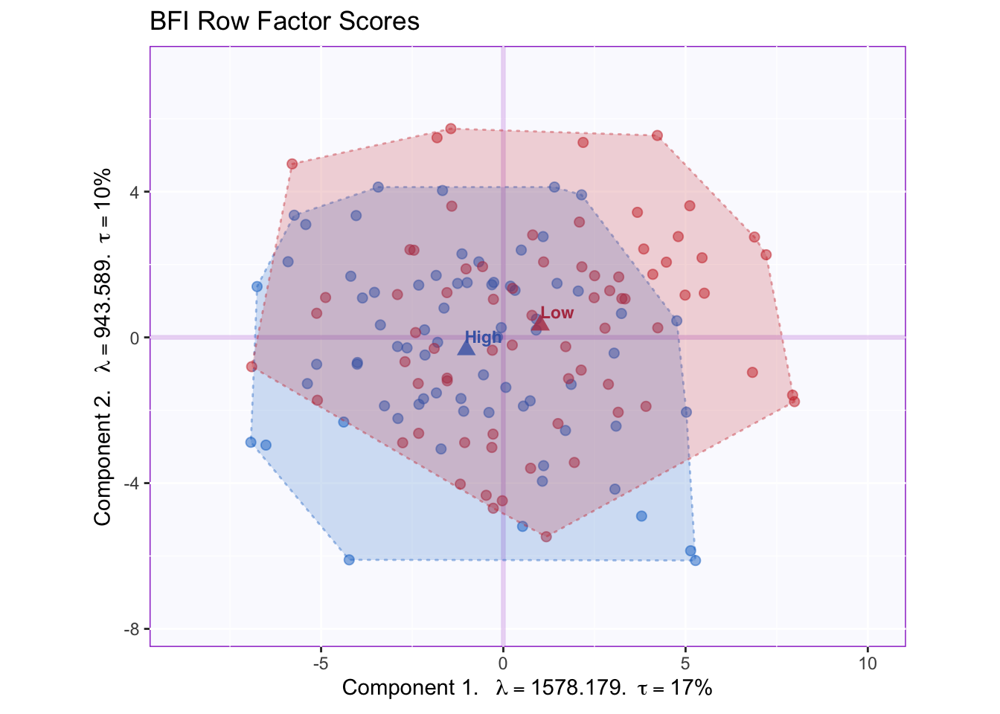
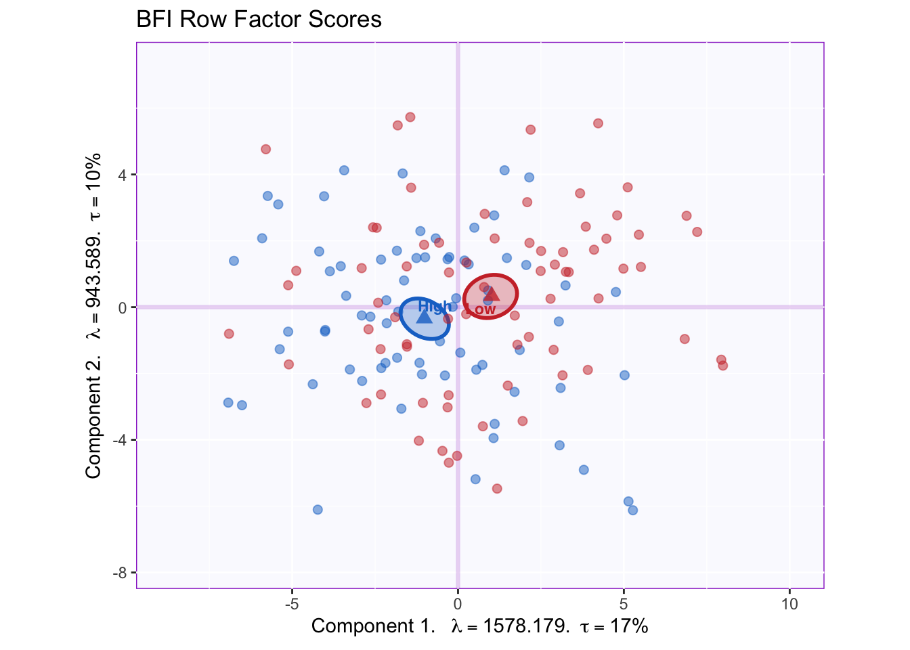
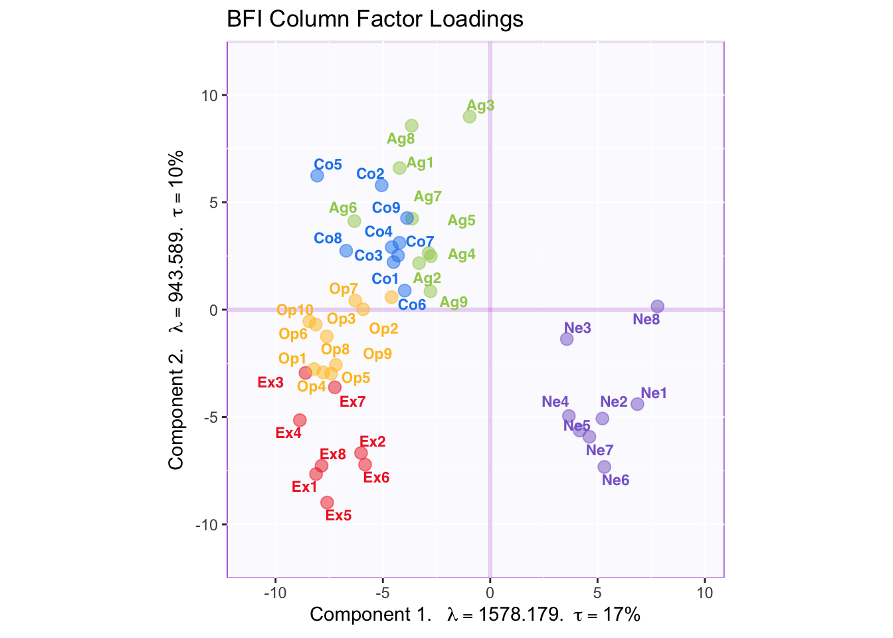
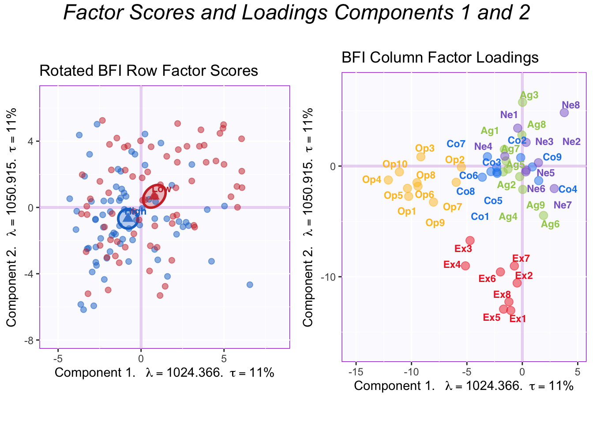
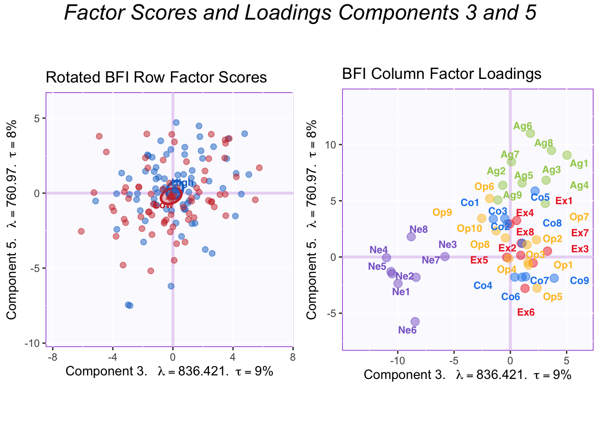
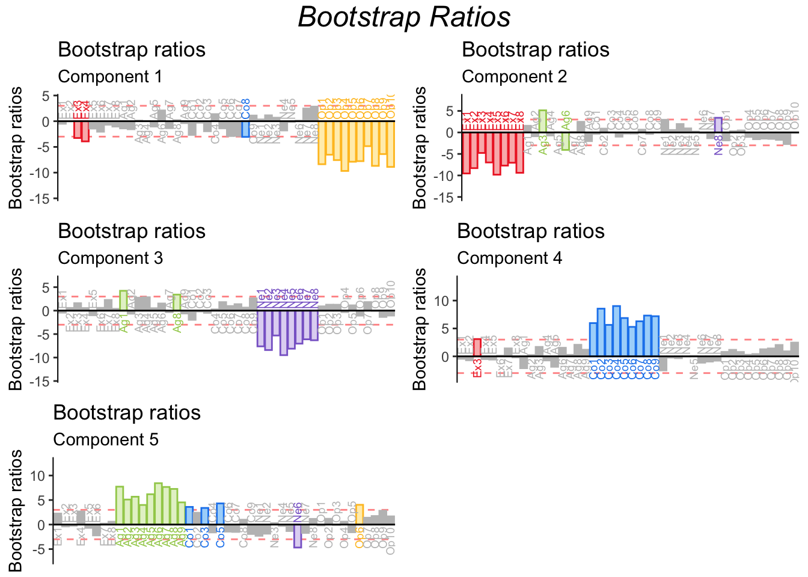

# Principal Component Analysis


Principal Component Analysis (PCA) is a data-reduction technique that extracts the most important information out of a data table of quantitative variables. To accomplish this, PCA computes new variables called principal components through linear combinations of the original variables in a data set. This operation is equivalent to performing the singular value decomposition (SVD) on the original data set, which amounts to performing an eigendecomposition of the covariance or correlation matrix. 

### Criteria for principal components
#### Maximal Inertia
Inertia is a quantity that denotes the total variance in a matrix. The first principal component in a PCA-solution will capture most of the inertia in a covariance/correlation matrix.

#### Orthogonality
The second principal component (and third and so on) also maximizes variance explained. However, this is done under the constraint that this variance be orthogonal (i.e. independent) to variance explained by the first component (or, in general, orthogonal to all other previous components). Thus, the overall set of components that results are mutually independent. This implies that PCA will reveal how many *dimensions* of variability exist within the data.

#### A Little linear algebra detour!
A covariance matrix can be calculated by multiplying a matrix (i.e. data set) by its own transpose. Thus, the diagonal of the resulting matrix will contain the sum of squares for each of the original columns (i.e. variables), and the off-diagonal elements correspond to the sum of cross-products between the variables that intersect at that cell. Obviously, the covariance matrix is symmetric.  
\indent The correlation matrix is obtained from the covariance matrix via an extra step: the normalization of each column by the total sum of squares. This procedure constrains the elements of the diagonal (i.e. the sums of squares) equal to 1. Thus, all cells will have values between 0 and 1 which correspond to the correlation coefficient.

## The Data 
To illustrate how to interpret results from PCA, the present chapter analyzes a data table containing 144 observations corresponding to participants who took the Big Five Inventory Questionnaire. Thus, the table contains 44 columns consisting of Extraversion (8), Agreeableness (9), Conscientiousness (9), Neuroticism (8), and Openness (10) items.  
\indent The observations on this data can be classified into one of two groups—High Episodic Memory and Low Episodic Memory—according to the (quasi-) experimental design.


```
##   Ex1 Ex2 Ex3 Ex4 Ag1 Ag2 Ag3 Ag4 Co1 Co2 Co3 Co4 Ne1 Ne2 Ne3 Ne4 Op1 Op2 Op3
## 1   5   2   4   4   2   4   5   3   5   4   5   2   3   4   5   5   2   5   3
## 2   2   2   4   4   3   4   4   4   3   2   4   3   2   2   4   3   5   5   5
## 3   3   2   4   3   1   1   1   5   1   1   2   4   5   5   1   5   5   4   1
## 4   2   2   2   2   2   5   5   3   3   4   5   2   5   3   2   4   4   5   5
```

## Correlation Matrix
Since PCA decomposes a correlation matrix, a natural starting point is to visualize said matrix and take note of the strength and directions of the correlation patterns. 


In this correlation matrix, a couple of features can be highlighted. First, there is a strong pattern of correlation between items of the same type. Second, Neuroticism items are negatively correlated to other types of items. These patterns will drive how PCA displays the information in this table.

## Running PCA
PCA is executed with the 'epPCA' function from the ExPosition package. The function takes multiple parameters:
  
1. the data must be preprocessed so that only the quantitative variables of interest are included as parameters to the function.  
2.  scale = TRUE or 'SS1' vs scale = FALSE: the choice of whether or not to scale will depend on the data at hand. In this case, the data is comprised of responses to items from a single questionnaire and all items follow the same Likert scale. Since all items have the same unit (i.e. use the same response scale), not scaling would allow for the preservation of important information. For example, some items may capture more variance than others, or may vary under very specific conditions thus revealing the importance of these conditions. However, in cases where units for the columns differ, **not** scaling would cause certain columns to 'illegitimately' dominate the PCA decomposition of the table. Thus, as a rule of thumb, scaling is necessary when units of the columns differ and optional (but preferable) when units are the same.  
3. center = TRUE: the data is centered by default.  
4.  DESIGN: if there was an experimental design that informed data collection then it can be entered here. This will allow for visualization of group membership. However, other categorial variables, can be entered here too, regardless of whether they are integral part of the experimental design (i.e. posthoc).  
5.  graph: turned off by preference.  

```r
resPCA = epPCA(bfi.quant,
               scale = FALSE,
               center = TRUE,
               DESIGN = memoryGroups,
               graph = FALSE
               )
```
## Scree Plot
The scree plot below visualizes the amount of inertia explained by each component: the eigenvalue associated with each component (i.e. eigenvector). 


#### A note on the Permutation Test  
A key question whenever performing PCA on any data is 'how many components should be kept'? A way to answer this is by distinguishing between significant and non-significant components. This distinction is done all the time in the framework of null hypothesis significant testing. Following the overall reasoning of NHST, if our statistic of interest (i.e. eigenvalue of a component, or total inertia explained by a component) has a value which is unlikely to occur by chance, we may conclude that the observed statistic is (statistically) significant.  
\indent However, the problem when doing PCA is that it is not evident what the distribution of eigenvalues is under the null hypothesis. The permutation procedure allows for the derivation of a distribution (of eigenvalues) when the null hypothesis is true. This is done by rearranging our data set in a way that breaks any relationships between columns or between rows that might exist—see Berry et al., 2011. 
  
The scree plot shows that the permutation test highlighted 5 components as being statistically significant. Visualization of factor scores and loadings is show for these 5 components below. 

## (Row) Factor Scores
PCA summarizes a data table so that the resulting components capture most of the variance between data points. Therefore, PCA can be thought of as drawing an axis across a multidimensional array of data points, under the condition that projections of the data points onto the first axis are *maximized*; alternatively, it is the distance between the data points and the axis that is *minimized*, in a least-squares sense. The concept of a row factor score (or factor scores) corresponds to this geometric projection of data points onto a component's axis: projection onto axis (i.e. factor scores) = distance of data point from the origin * angle (i.e. loading; explained below).   
\indent The graph shown below corresponds to a representation of observations (i.e. data points) according to the first and second components. Points are colored by group membership.


We can appreciate that the x-axis corresponding to component 1 captures more spread in the data (17% of inertia) relative to component 2. This will always be the case as component 1 extracts the most variance.  
\indent The means of each group are also displayed. It appears that groups migh differ according to the first component. However, without a within-group variability estimate, there is as yet no way through which conclude that this difference is statistically significant. 
  
## Tolerance Intervals



A convex hull that contains all data points in a group is a good way to graph the total range of factor scores associated with that group. The graph shows that the overlap between groups is high, since the majority of the data point can be found at the intersection between the convex hulls.

## Confidence Intervals
Confidence intervals for each group's mean can be calculated by computing the bootstrap distribution of group means and excluding value at the tails (e.g., 2.5% in each direction to obtain a 95% confidence interval). This would be the equivalent to a (post hoc) significant testing. 

#### A note about Bootstrapping 
The Bootstrap method serves as a way to quantify the behavior of population parameters or other statistics. As applied here, the general principle behind the bootstrap is to generate multiple alternate samples for each subsample (i.e. memory groups) so as to simulate their distribution if the experiment were to be replicated. Observations from a group are sampled randomly and *with* replacement, then the mean for the group is calculated for this distribution. The procedure is repeated a large amounts of times (1000 times in this example) to produce a distribution of group means, and from this distribution the confidence interval of the means is computed for the group.  
\indent Note that the random sampling in a bootstrap procedure draws an entire row from the dataset. Thus, a key feature of the bootstrap is that it preserves the associations between variables, or the effect found in the data, whereas the permutation test does not.  
 
The ellipses graphed below represent the 95% confidence intervals (for components 1 and 2).



Groups statistically differ on component 1; the projection of the ellipses onto component 2 overlap therefore this component does not differentiate between groups.  
\indent To interpret this difference between groups, we will want to know what variables constitute component 1.
  
## (Column) Factor loadings
In PCA, the rows (i.e. observations) of a data set are described by their factor scores or projections; the columns, however, are described by their loadings or correlations. The combination of the two (scaled by the eigenvalues) gives a complete description of the original data. (Recall the formula, "projection onto axis (i.e. factor scores) = distance of data point from the origin * angle (i.e. loading)").  
\indent Each variable stands in relation to each of the components and this relationship is described by the (cosine of the) angle between a the variable vector and a component.  
\indent Note: The factor loadings graphed below have been scaled to represent the total amount of variance in components 1 and 2 (and beyond). This can be done by multiplying the factor loadings (i.e. matrix Q of the SVD) by the diagonal matrix of the eigenvalues.  
  
  The plot below captures the overall correlation pattern of the table. 



Interpreting the angles between variables, the plot shows that items of the same type tend to be associated with each other—the tip of the vectors of the same color point toward the same general direction. The plot also reflects the correlation matrix insofar as neuroticism loads negatively on component 1 which reflects the negative correlation between neuroticism items and other item types. Component 2, however, is more difficult to interpret. 
 

## Factor Rotations (Varimax)
To aid interpretation, factor rotation can be applied to results of a PCA. Varimax, the most popular rotation method, correspond to a rotation eigenvectors within subspace—e.g., the 5 significant components in this example—so that each item loads onto as few components as possible under the constraint that these components remain orthogonal to each other.  
\indent Our original correlation matrix showed that there is a clear structure in which items of the same type are strongly correlated with each other. In the graph of the factor loadings, component 1 reflects the overall correlation pattern between item types, not within item types. Therefore, performing a varimax rotation would clarify the factor structure so that each component reflects the within-type correlation for a specific item type.  
  
### Running varimax
The code below is used to run varimax on the results of a PCA. Based on the orignal scree plot I decided to keep 5 dimensions. 

```r
vari.PCA = epVari(resPCA, dim2keep = 5)
```

This screeplot shows this dimensions after rotation: the eigenvalues have less of a spread, indicating that they are represented more equally. 


### The effect of varimax

The plot of factor loadings after rotation shows the effect of varimax. 


The difference between group means becomes more evenly distributed across the first two components. Thanks to the simplified structure, it is evident that the first two components reflect Openness and Extraversion. Thus, the High memory group is higher than the Low memory group in both Openness and Extraversion.

To showcase the full effect of a varimax rotation, all the factor loadings for the significant components are graphed below.


The plots of components 3 and 4 show that they correspond to Neuroticism and Conscientiousness, respectively. The memory groups do not differ in either of these personality dimensions. 



These plots show components 3 and 5. Component 5 corresponds to Agreeableness and there is no difference between groups here. 

In summary, varimax revealed the underlying psychometric model in the BFI: that there are 5 largely independent factors of personality measured by this questionnaire. 

## Contributions
Another tool to interpret the components is to calculate contributions. Contributions reflect how important a column (or row) is to the interpretation of an eigenvector/component. The contributions can be calculated for both the rows and the columns by squaring the factor scores for an element and dividing by the eigenvalue in question. Columns (or rows) with a (squared) contribution above the average should be used to interpret a component.  
\indent Graphing row contributions would be a good way to detect outliers. In this example, however, I only show the contributions for the components. 


The barplots for the contributions shown above confirm what we already concluded from graphing the factor loading. Since contributions are derived from factor loadings (by loadings, it is meant the "scaled" loadings that have been multiplied by the corresponding eigenvalue), it naturally follows that this information is replicated. Graphing contribution does make explicit, however, the threshold for importance and highlights important variables only, making the graph more readable in some cases. 

## Bootstrap Ratios
In general, a bootstrap ratio is a quantity akin to a t-test, calculated from a bootstrap distribution instead of a theoretical t distribution. In the context of PCA, bootstrap ratios are almost always used to test the stability of the contributions (of the variables or observations).  
\indent The procedure is simple. Bootstrapping—i.e. running PCA multiple (i.e. 1000) times with different bootstrap samples each time—generates a distribution of contribution values from which we can extract the mean and the standard deviation for each variables. The mean contribution is then divided by its corresponding (mean) standard deviation to produce the bootstrap ration. Bootstrap ratios more extreme than 2 (or -2) reflect that that variable's contribution is statistically significant (p <.05). This threshold of 2 can be modified to account for multiple comparisons. The threshold for this example is equal to 3, corresponding to p < .001.  

The bootstrap ratios shown below confirm the stability of variable contributions. 
  


## Summary

PCA (with a varimax rotation) was used in this example to reveal the underlying structure in the BFI questionnaire. Results showed that the BFI capture variability in personality across 5 different dimensions: Openness, Extraversion, Neuroticism, Conscientiousness and Agreeableness. Further, High and Low Episodic memory groups showed differences in their levels of Openness and Extraversion.  
\indent In further analyses, I explore the correlation between memory and these personality dimensions further. 


