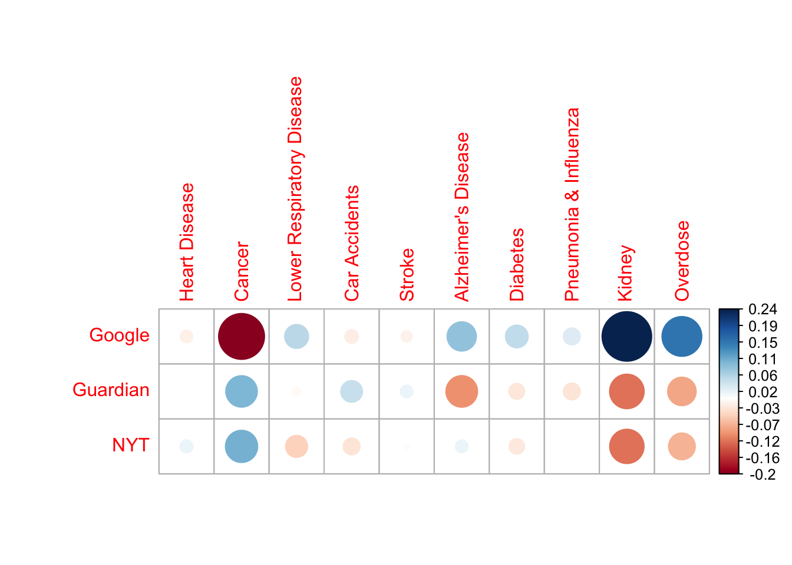
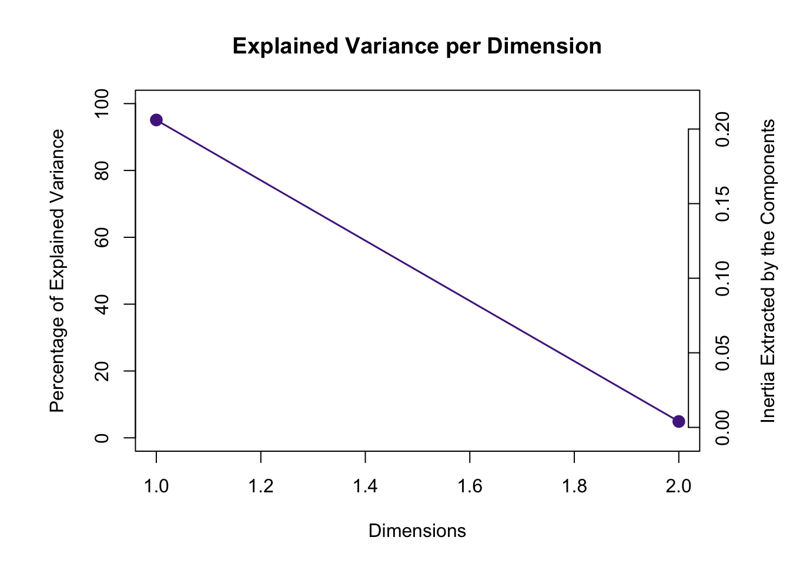
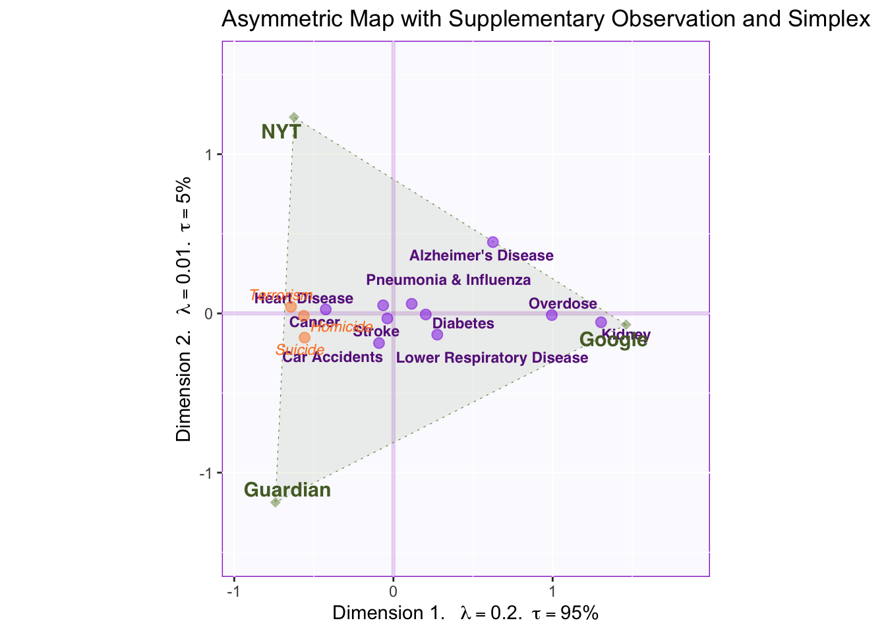
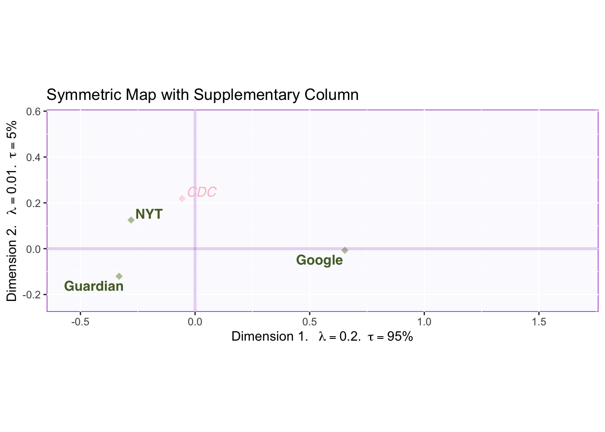
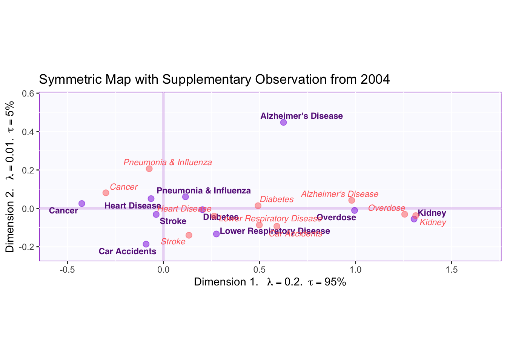
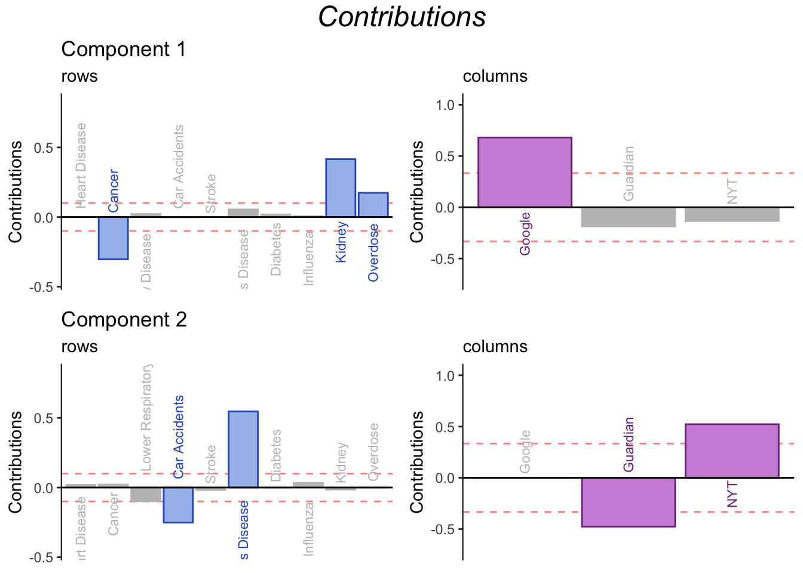
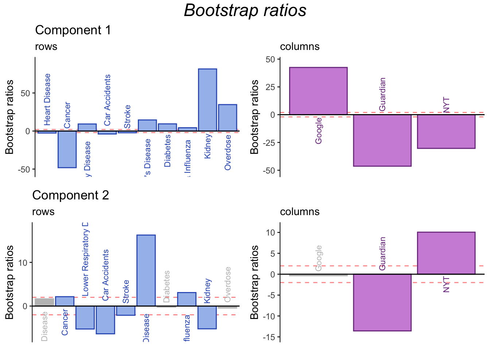

# Correspondence Analysis


Correspondence Analysis (CA) is often described as an adaptation of PCA for categorical data. This means that CA extracts the important information from categorical variables in a way that can be interpreted geometrically.  A key difference is that the data analyzed in CA is not a covariance/correlation matrix as in PCA. Instead, CA analyzes a contigency table between two categorical variables.  
\indent Prior to running CA, the counts in a contingency table are transformed to instead reflect probabilities. This is equivalent to dividing the matrix by its sum. Then, the factor scores are calculated through the generalized singular value decomposition (GSVD) of the probability matrix (i.e. Z). A key difference between GSVD and SVD is that GSVD accounts for masses and weights as added contraints. 
  
### Masses and Weights  
Masses correspond to rows and weights correspond to columns. These quantities reflect the importance of a row or column, respectively; they amount to the proportion of cases in a row (or column) relative to the rest of the table. For example, if a column is not used often then it contains **more** information since rare cases allow us to discriminate better. Thus, the weights (and masses) are calculated as the **inverse** of the proportion this column (or row) represents in the total table. 
  
### Two kinds of factor scores
Another difference between PCA and CA is that CA calculates two set of factor scores: one for the rows and one for the columns. Thus, the space between rows and column factor scores is interpretable—unlike PCA, where, for comparing observations to variables only the angles and not the distances are compared. 

## Data
The data analyzed in this example is a contingency table containing counts of how many deaths of each type are reported in different news media. Type of death can be found in the rows, while news outlet is found in the columns. 

Let's introduce the concept of active and supplementary data. (This concept is relevant to all multivariate analyses in this document but is introduced here due to its central role in this particular example of CA.) 


```
##                              CDC Google Guardian  NYT
## Heart Disease             629474    437      508  577
## Cancer                    613832    842     3049 3128
## Lower Respiratory Disease 154596    534      383  271
## Car Accidents             159340    436      677  442
## Stroke                    101328   1042     1246 1171
## Alzheimer's Disease       116103    351        1  234
## Diabetes                   80058    771      541  555
## Pneumonia & Influenza      51537    721      555  671
## Kidney                     56021    945       34   41
## Suicide                    44876    389     3370 2497
## Homicide                   19103    652     5597 5285
## Terrorism                      0    300     7987 8266
## Overdose                   58335    572       68   92
```

#### Active data
The term "active data" refers to the data that is used to compute factor scores, or the data inputted in the CA function. In carrying out any multivariate analysis, it is important to choose which data will be active and which data will be left out. In the data shown above, it is evident that deaths reported by the CDC far outnumber those of other news outlets. Consequently, if this column were to be included the contribution of CDC would dominate the CA results, leaving little room for other news outlets to contribute. Thus, this column is not included as active but instead as a supplementary column. 

#### Supplementary data
Any data that is not used to calculate factor scores can be projected onto the vector space of the CA results to aid interpretation. This is the meaning of supplementary data. Along with including the CDC as a supplementary column, the rows for Suicide, Homicide and Terrorism will be excluded from the active data set and included as supplementary rows. 
  
## The contingency table transformed: table of deviations. 

The table displayed below is not a correlation matrix like in PCA. Instead, it is the result of applying a transformation onto the contingency table so that each cell represents the deviation from expectation (based on the row and column totals). Thus, the big red dot at the intersection of 'Google' and 'Cancer' signifies that the amount of cancer deaths reported by Google fall far below the mean of cancer deaths reported by all news sources in the data. 



## Running CA
CA is executed by the 'epCA' function in the ExPosition package.
The code below shows what parameters are relevant for running CA:

1. how the data is arranged/transposed (i.e. which categories are in the rows and which in the columns). This is especially important in asymmetric CA solutions.
2. whether column factor scores will be symmetric or asymmetric. 


```r
resCA.sym  <- epCA(X, symmetric = TRUE, graphs = FALSE)
```


## Scree Plot

The scree plot below show that the data can be described by two dimensions. And the permutation test shows that both components are statistically significant. However, total variance explained varies widely between the two components: the first explains 95% of the variance and the second only 5%. This should be kept in mind when interpreting factor scores. 


## Asymmetric plot
As mentioned above, a defining characteristic of CA is that the relationship between factor scores for the rows and the columns can be represented in two ways: symmetrically or asymmetrically. The difference between the two is on whether column factor scores are weighted according to (the inverse of) the proportion of inertia relative to the whole table.  
\indent The plot below is called an asymmetric biplot. In this kind of graph, the space between columns is represented with the weights of each column in mind (i.e. weights multiply the distance of each column factor score from the origin). The purpose of graphing an asymmetric biplot is that it allows for direct interpretation of the space between a row and a column.



The relative distance between a row and all columns provides information over how characteristic that row is for each column. Since CA analyzes the probability matrix of deviations from the average, factor scores nearest to the origin are not particularly characteristic of any particular column but instead characterize the average column. Conversely, factor scores at the extremes provide more information about particular cases.  
\indent For example, reporting deaths related to Kidney failure is closer to Google than to other news sources, therefore reporting this type of death characterizes Google relative to other news outlets. Deaths by Alzheimer's Disease are closer to Google than to other news outlets as well, but between NYT and the Guardian AD deaths gravitate towards NYT. 
  
#### Interpreting components 
The first component explains most of the variance in this table. Since it separates between Google and NYT and The Guardian, we can conclude that this component represents traditional vs. crowd-sourced media. Row factor scores supply information about what kinds of deaths are reported across each type of media.  
\indent The second component explains less variance. It might only be distinguishing between NYT and The Guardian, a not so interesting point; however, we might be able to (perhaps) generalize this pattern to British vs US media, but having more columns representing these media would be helpful to make this interpretation. 
  
#### Supplementary Projections: Homicide, Suicide, Terrorism. 
Deaths related to Homicide, Suicide and Terrorism where excluded from the main, active data set. Yet by projecting these as supplementary rows onto the vector space, information can be acquired from these data without them dominating the results of the analysis.  
\indent The projected factor scores show that these types of death are extremely characteristic of the traditional new outlets and they are reported equally in NYT and The Guardian. This helps further characterize what distinguishes between traditional and crowd-sourced news outlets: more sensational but rarer deaths tend to be reported more in the newspaper. 

## Symmetric Plot with CDC

Symmetric Plots allow for the examination of one type of factor score (i.e. either rows or columns) relatively well since they accurately represent column factor scores from the point of view of total variance explained. Further, we can easily project supplementary elements (again, either rows or columns depending on the active factor scores being represented) to gain additional information on the resulting components. 



This graph shows all columns from the original data (with CDC as a supplementary projection). Symmetric plots show the column scores in relation to the amount of variance explained. Thus, the plot shows the distance between factor scores on the left and on the right is much wider than the distance going up or down.  
\indent By focusing on CDC factor scores, we can strengthen our interpretation of components 1 and 2. In relation to component 1, the CDC falls relatively close to the middle. Since, the CDC is the most objective source for all types of deaths (in the US), we can interpret deviation of columns relative to the middle as deviations from objectivity: traditional news sources report sensational and rare deaths, however, this does not mean that Google reports "the true proportions" of deaths. Rather it seems that both extremes deviate from objectivity: and what component 1 might be reflecting is how much people seek out information on certain deaths (e.g., people might spontaneously worry about overdose more frequently than being a victim in a terrorist attack).  
\indent On component 2, the CDC loads highly on the positive end (4 times closer to NYT than The Guardian). Since the CDC is based in the U.S., this lends support to the interpretation that dimension 2 captures a regional effect, such that death reports on NYT more closely align with total deaths reported in the US. However, when compared to the effects captured by the first component, this regional effect seems to be rather small. What matters most is the kind of news outlet (i.e. traditional vs. crowd-sourced).
 
## Symmetric Plot with data from 2004
We have another interesting research question: we want to know how the reporting of certain deaths has changed over time. To answer this question, we supplementary project a table with the same columns and rows but for 2004 deaths and display the results in a symmetric map. 



Examining the graph above shows that the most striking change has been on how Alzheimer's Disease deaths are reported. The factor scores for AD have moved to the left and up. This means that, relative to 2004, Alzheimer's Disease deaths have started to be reported more by traditional news media. Similar patterns can be appreciated for Overdose, Diabetes, Heart Disease and Cancer. Further, the vertical change indicates that AD started to be more reported by NYT in recent years. (Perhaps this could be generalized to all US media if we had more data).

## Contributions
Contributions in CA are interpreted just as in PCA. The main difference is that, in CA, contributions to both row and column factor scores are of interest. (They can also be of interest in PCA if there are clusters of participants).



The contribution barplots confirms our interpretation: component 1 distinguishes between Google and traditional news outlets, while component 2 distinguishes between NYT and The Guardian (or US vs British Media if the pattern were to be generalized). From the point of view of the rows, the contribution barplots isolate rows that are of special importance for understanding difference across news outlets. Contributions of the rows show that Google reports more Kidney and Overdose death than traditional outlets. Conversely, Reporting cancer deaths is relatively uncharacteristic of Google when compared to other news outlets. 

## Bootstrap ratios
Bootstrap ratios are computed to test the stability of contributions.



In general, bootstrap ratios show that the contributions are stable. In particular, more information can be gleaned from contributions to component 2, further clarifying differences between the Guardian and NYT (or British and US media in general).

## Summary
CA was used to analyze to a contingency table of type of death reported (rows) by news outlet (columns). The analysis revealed that news outlets can be classified according to a traditional vs crowd-sourced dimension (component 1), and that this dimension captures distinctions between everyday concerns and rare diseases (or human-caused death), the latter being more characteristic of traditional news. Further, a second dimension corresponding to a possible regional effect was revealed by the inclusion of CDC as a supplementary column. Thus, NYT and the Guardian differed on this dimension (with NYT reporting deaths that more closely align with total deaths in the US).


