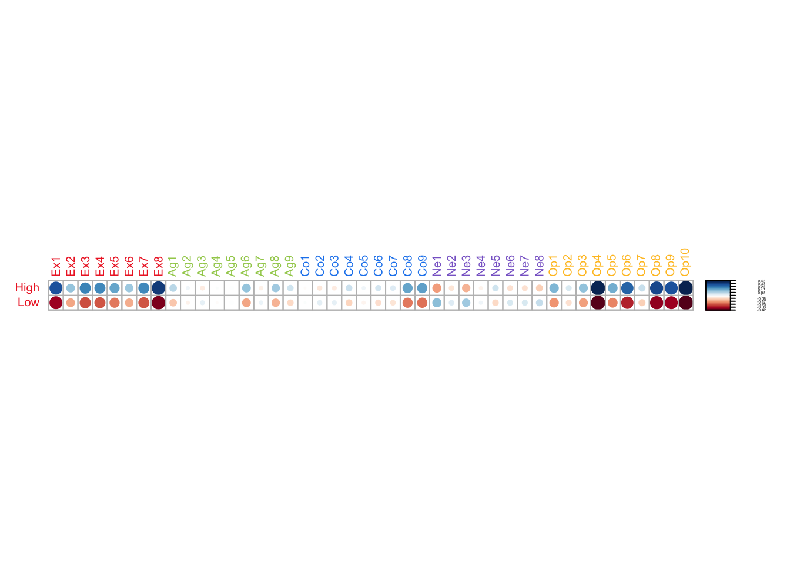
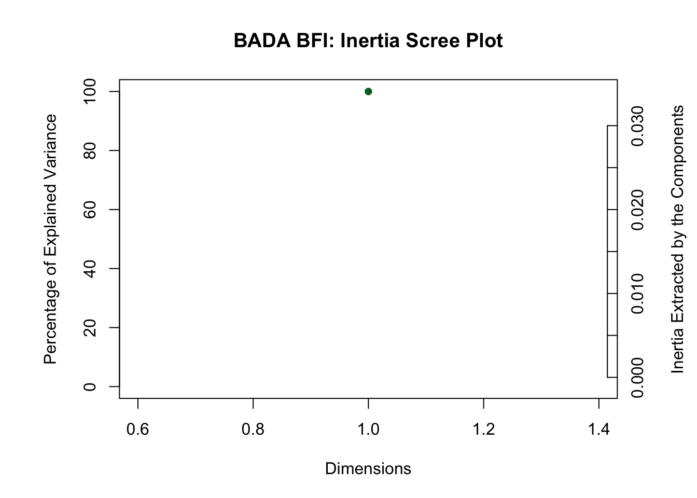
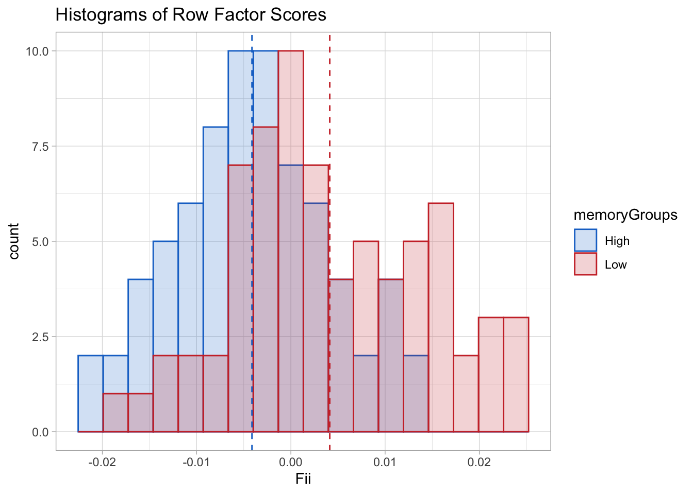
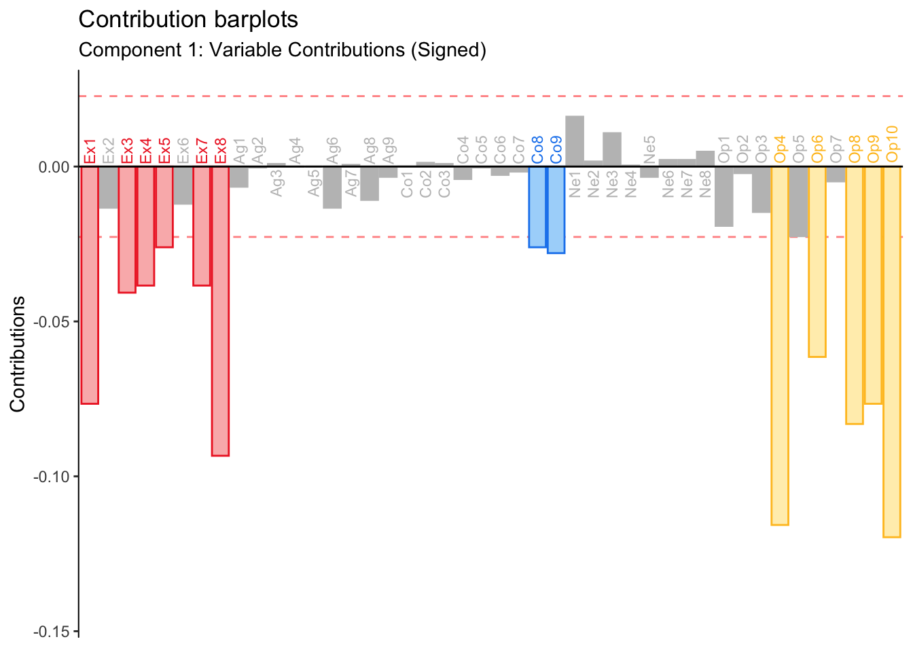
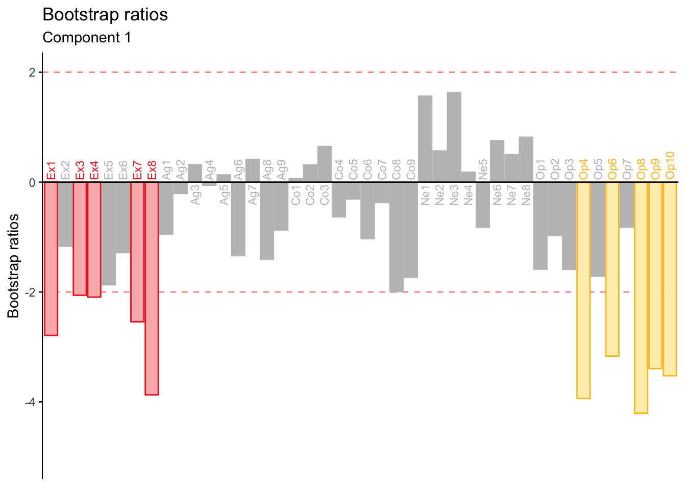

# Barycentric Discriminant Analysis


Barycentric Discriminant Analysis (BADA) is a version of discriminant analysis that utilizes the eigen-decomposition to assign observations to a-priori groups. As such, BADA is a classification algorithm whose main purpose is to determine how well certain data can classify groups of observations. To do this, BADA utilizes the eigen-decomposition to maximize between-groups variance. This is accomplished by an SVD of the groups-by-variables matrix (instead of observations-by-variables as in PCA), which computes linear combinations of variables which will maximally distinguish between groups. Each row of the groups-by-variables matrix represents the **barycenter** of a group, hence Barycentric Discriminant Analysis. After computing the vector space, the invidual observations composing the groups are projected and classified according to which group barycenter is the  least distant.  

## The Data
In this example, the same BFI data is utilized to illustrate BADA. Results of PCA revealed that memory groups differ on their amount of extraversion and openness. In the results of PCA, this pattern was *implicit*, since the memory group design informed data collection and groups were equal in sample size. As such, an (unrotated) PCA indirectly captured a dimension which corresponded to variance due to the experimental factors. In the BADA algorithm, the goal of capturing between-group variance becomes **explicit**. Also, there is the added step of categorization, which provides an additional criterion for evaluating the correlation of memory and personality. Nevertheless, results from BADA should closely resemble those from PCA for this particular data.

## Group by Variables Matrix

Below, the matrix to be analyzed by BADA is visualized. For each variable, the element in a row show the deviations of the group means from the grand mean. Since there are only two rows (i.e. groups), each value has its mirror value in the other row: a positive value in one row would be equal but negative on the other row.  


A strong pattern of differentiation between the memory groups is revealed on scores of Openness and Extraversion.

## Running BADA
BADA is executed by the 'tepBADA' function in the TExPosition package. In this particular implemention, the columns were not scaled by their standard deviation. As in PCA, this is because all columns have the same unit: the same Likert scale. Thus, not scaling preserves variance. 


```r
resBADA <- tepBADA(bfi.quant, DESIGN = memoryGroups,
                   graphs = FALSE,
                   scale = FALSE)
```

```
## Warning in pickSVD(datain, is.mds = is.mds, decomp.approach = decomp.approach, :
## Solution has only 1 singular vector (or value). Zeros are appended for plotting
## purposes.
```


## Scree Plot
The dimensionality of the resulting vector space, as in all SVD-based methods, is constrained by the number of rows and columns. In this case, the number of dimensions cannot exceed the number of groups. Thus, BADA returns one single dimension which account for all the inertia in the table.


## Factor Scores
Factor Scores for the rows can be calculated (and graphed) just as in PCA. However, due to there only being one dimension in this particular implementation of BADA, factor scores are represented with histograms. 


The plot shows that the distribution for the two groups is distinguishable yet there is a high amount of overlap. A good way to quantify this overlap is to rely on the accuracy of the classification procedure (see Classification section).

## Contributions
 Since the present eigen-decomposition consist of only one dimension, contributions are plotted in the place of factor loading.  
\indent A key attribute of the contributions is that they are a scaled version of the loadings (or factor scores): contributions for columns (or rows) are calculated by squaring each loading and then dividing by the eigenvalue of that dimension. As such, contributions provide similar information than factor scores, with the added bonus of a threshold (i.e. the mean contribution for the given dimension) to determine relative importance. 



As predicted, the contribution barplot reveals a pattern highly resembling the PCA results. Extraversion and Openness discriminate between memory groups. BADA, however, suggests that conscientiousness might also play a role between group differences.

## Bootstrap Ratios
As a refresher, bootstrap ratios quantify the stability of the contributions. Below are the bootstrap ratios for the variable contributions to dimension 1.


The overall pattern appears to be stable. The contributions from Openness were the most stable, followed by Extraversion and Conscientiousness.

## Classification: Confusion matrices
The key feature that distinguishes  BADA from PCA is the classification procedure. Below, I display two confusion matrices, which summarize the performance of this classification procedure. A confusion matrix displays signal detection: the numbers in the diagonal represent instance of correct classification (i.e. hits), while off-diagonal elements represent incorrect classification (i.e. false alarms or misses depending on point of view).

#### Fixed-Effect Confusion Matrix

```
##       .High .Low
## .High    53   26
## .Low     19   46
```
The Fixed-Effect Matrix reveals how the classification procedure performs for each group. The High group was classified more accurately than the Low group in this instance.  

Overall accuracy is also reported below and should be intepreted as the improvement over randomness. This index is calculated by adding the elements in the diagonal and scaling by the total cases that were classified: it represent the percentage of correctly classified cases.

```
## [1] 0.6875
```

The algorithm performs moderately well. However, as the section below shows, accuracy estimates calculated form the fixed effect matrix overestimate fit. 

#### Random-Effect Cross-Validation
A goal of developing classification algorithms is to have a procedure where observations can be classified by using only the data at hand and with no a priori information of group membership. Therefore, what is of real interest—from an algorithm persepctive, instead of a descriptive perspective—is how BADA performs with new observations that have not been factored in the calculation of the eigen-vector space.    
\indent The implementation of the random-effect classification reported below is known as a 'leave-one-out' cross-validation, or 'LOO'. The LOO consists of running BADA as many times as there observations but leaving each observation out of the SVD one time. The left-out observation is classified each time and the result is saved onto a matrix, which contains group assignments for each of the observations. The results for this example are displayed in a confusion matrix below.


```
##                 .High.actual .Low.actual
## .High.predicted           50          33
## .Low.predicted            22          39
```

Examining the matrix, it is apparent that the leave-one-out procedure performs worse than the fixed-effect classification. This is always the case since the fixed confusion matrix is biased by virtue of each observation being included in the SVD used to classify it. Theerefore, the accuracy of the loo provides a less biased estimate than the one show above.


```
## [1] 0.6180556
```

Thus, BADA improves from chance classification by only 10% with 'out of sample' observations. Ultimately, a whole new set of observations will provide the best estimate for the performance of the classificaiton algorithm, however, the loo is next best method available.

## Summary
BADA performs a generalized PCA on the groups-by-variables matrix, maximizing between-group variance. Observations are project onto the resulting vector space and classified according to the closest barycenter. The performance of BADA is evaluated by the accuracy the loo cross-validation methods. In this instance, BADA revealed that Openness and Extraversion distinguish between memory groups, yet the random-effect accuracy index revealed that this effect is not that much better from chance.
