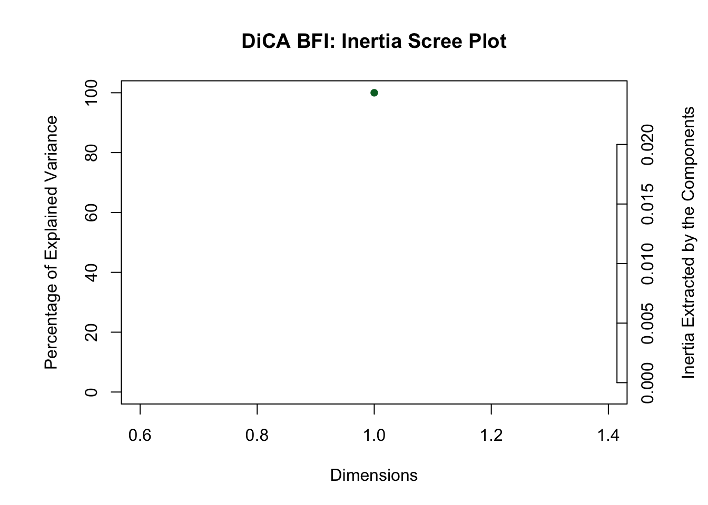
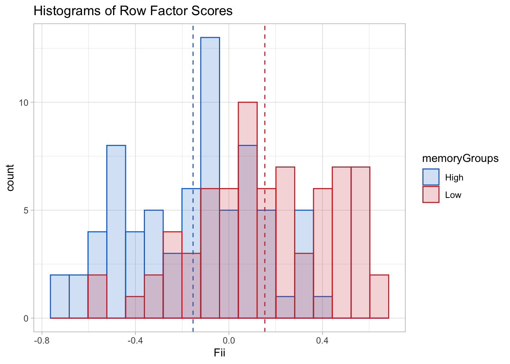
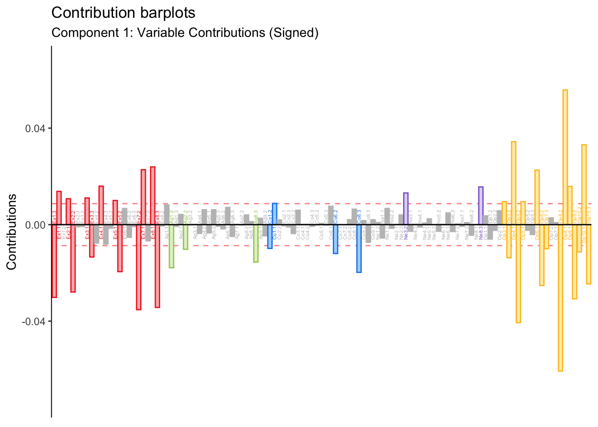
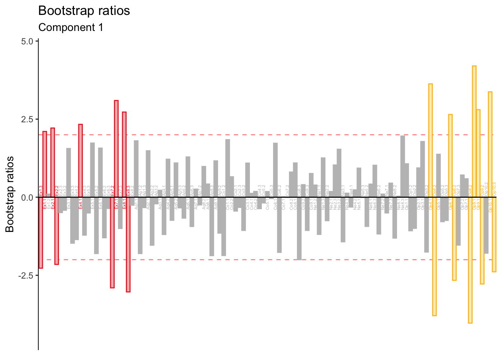

# Discriminant Correspondence Analysis


Discriminant Correspondence Analysis (DiCA) is a version of discriminant analysis that utilizes categorical variables to arrive at a optimal discrimination between groups. Like BADA, DiCA analyzes the groups-by-variables matrix. However, like CA, DiCA carries out the generalized singular value decomposition wiht masses and weights.  
\indent Because of the high overlap between these methods, this report focuses on key differences between BADA and DiCA results rather than a independent exposition of DiCA. 

## The Data
This report includes DiCA results for the analysis of the Recoded BFI matrix used in MCA (in which each variable was binned so that group sizes were as equivalent as possible).


```
##   Ex1 Ex2 Ex3 Ex4 Ex5 Ex6
## 1   3   1   2   2   3   1
## 2   1   1   2   2   3   1
## 3   1   1   2   1   1   1
## 4   1   1   1   1   1   1
```

## Running DiCA
DiCA is executed by the 'tepDICA' function in the TExPosition package. A unique feature of DiCA is the parameter group.masses which computes the relative importance of each group based on how many observations each contains. In a balanced design, this parameter can be ignored—as it is done here.  

```r
resDiCA <- tepDICA(bfi.quant.Recoded.dis, make_data_nominal = FALSE, 
                   #group.masses = g.masses,
                   # weight = rep(1, nrow(XYmat)),                    
                   DESIGN = memoryGroups, graphs = FALSE)
```

```
## Warning in pickSVD(datain, is.mds = is.mds, decomp.approach = decomp.approach, :
## Solution has only 1 singular vector (or value). Zeros are appended for plotting
## purposes.
```


## Scree Plot
As in BADA, the dimensionality of the DiCA results will usually depend on the number of groups (assuming the number of groups is less than the number of varianbles). Here, only one dimension is obtained since there are only two groups. 



## Factor Scores

The factor scores are displayed in histograms since there is only dimensions. Their distribution is slightly less smooth than in BADA but the non-overlap between groups is comparable.  



## Contributions
Signed contributions are reported for each of the BFI variables.  



As in BADA, Extraversion and Openness drive group differences. However, small contributions from other personality items—Agreeableness, Neuroticism—reach significance. 

## Bootstrap Ratios
Bootstrap ratios reveal that contributions from items other than Openness and Extraversion are not stable.  


The low-stability of these contributions suggests that BADA is more stable than DiCA in this data, likely due to the pre-processing step of binning variables and the many ways it could have been different. 

## Fixed-Effect Classification

```
##       .High .Low
## .High    51   22
## .Low     21   50
```
The confusion matrix above suggests that DiCA may be more symmetrical at classifying observations than BADA. The hit rate for the groups is equivalent while BADA tended to overclassify observations as belonging to the High memory (i.e. false alarms).


```
## [1] 0.7013889
```

Overall accuracy for DiCA remains comparable to BADA (if only slightly better).

## Random-Effect Classification

The random-effect confusion matrix suggests that the symmetry of classification of DiCA remains stable when classifying 'out-of-sample' observations. However, as evidenced by the accuracy index, overall performance is slighly worse than BADA.

```
##                 .High.actual .Low.actual
## .High.predicted           44          30
## .Low.predicted            28          42
```

```
## [1] 0.5972222
```

## Summary
DiCA performs a discriminant analysis when the data describing each group is categorical. The current analysis showed that DiCA classification was slightly worse than BADA's, yet a feature that should be remarked is that DiCA was less-biased toward classifying observations as belonging to the high group. It is conceivable than in some instances this feature would be preferable than a slighly better performance. Thus, DiCA remains a viable option for real-world implementations.
