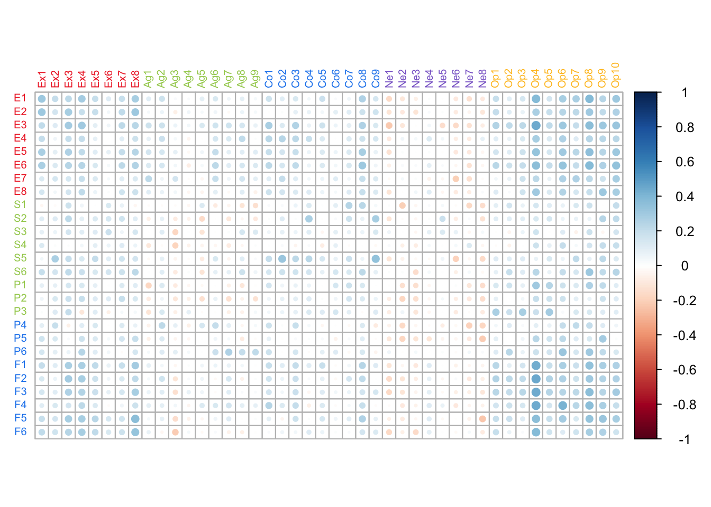
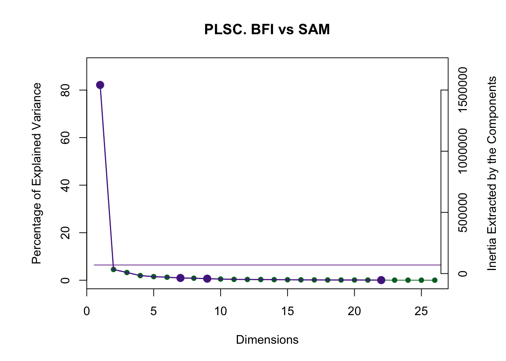
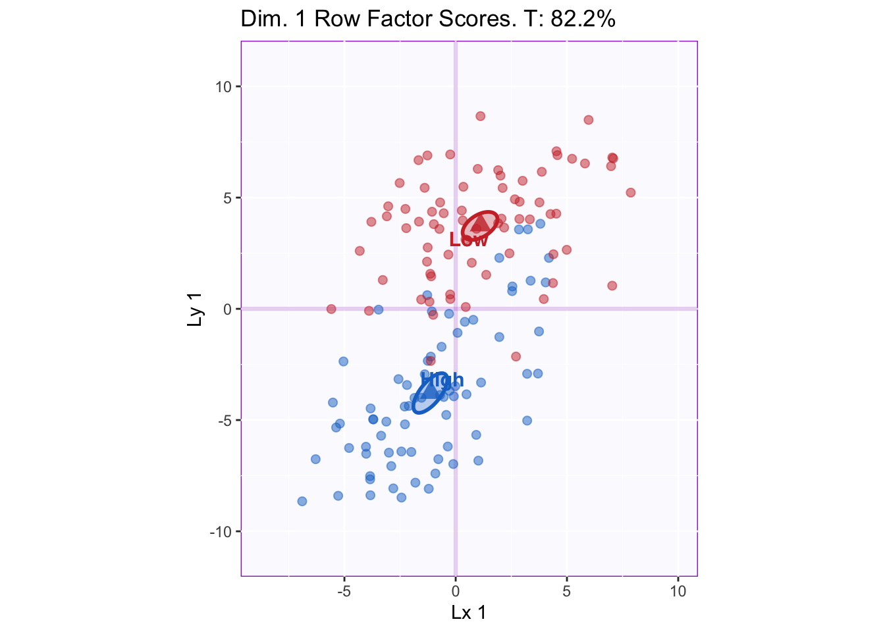
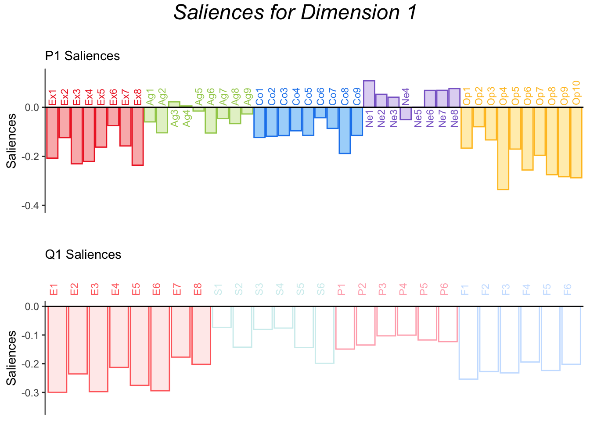
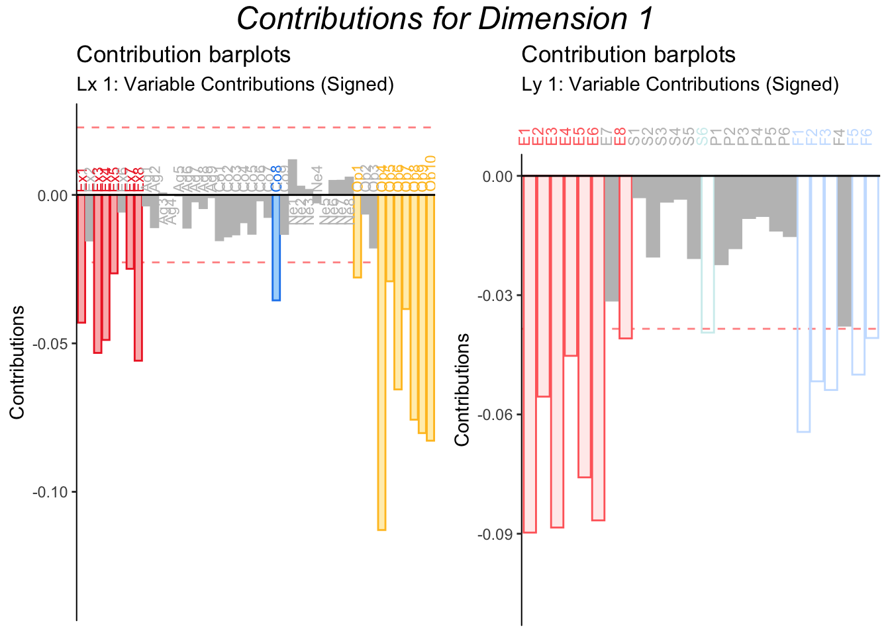
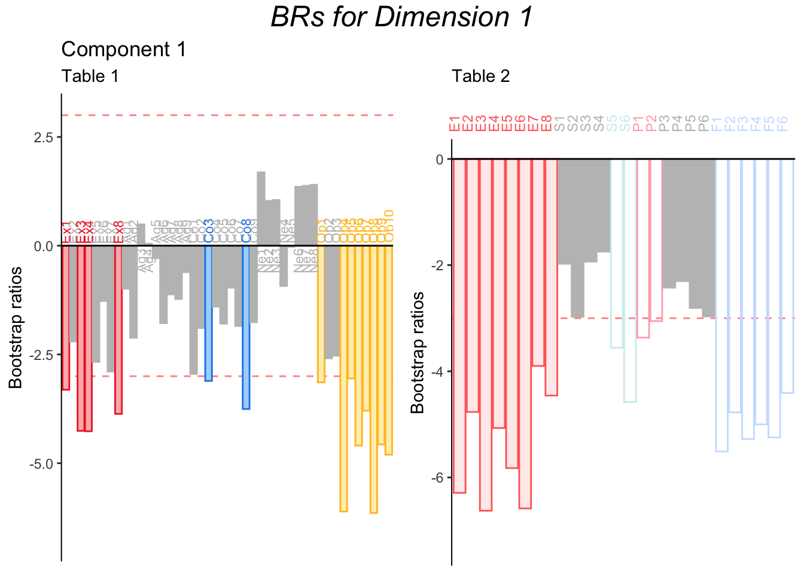
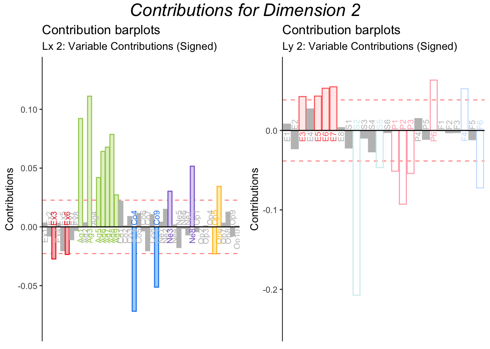
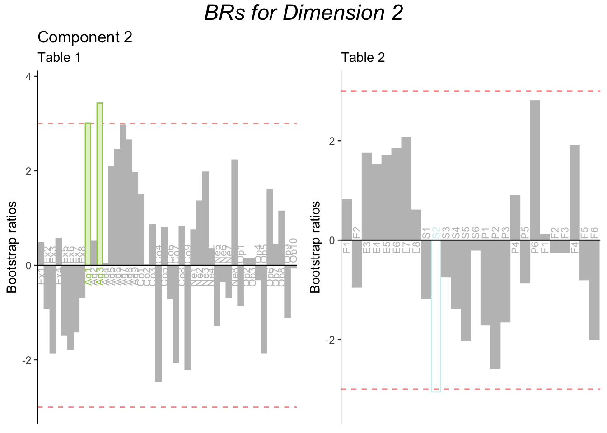

# Partial Least Squares Correlation


Partial Least Squares Correlation (PLSC) is a technique to extract the common information between tables. The SVD in PLSC decomposes, not the original data tables, but the matrix R which is the product of the Z-transformed original data tables. Thus, the each dimension of a PLSC analysis will maximize the covariance between two tables while following the orthogonality contraint of PCA-based methods. Some key differences between PCA are PLSC are highlighted.  

### Saliences
PLSC decomposes the R correlation matrix between tables as three separate but related matrices: U∆V^T^; where U and V correspond to the matrices of Y and X saliences, respectively, and ∆ correspond to the diagonal matrix containing the singular values (i.e. the square root of the eigenvalue). Saliences are similar to loadings and as such, they should be interpreted as the correlation between a variable and a component (i.e. the coefficient of a given variable in the linear combination that results in an eigenvector).  
\indent The key difference here is that PLSC computes two sets of saliences whereas PCA computes only one set of loadings. This is because latent variables and saliences are compute for both table X and Y, and each orrespond to one and only one table (e.g., saliences for latent variable x are only computed for variables from table X, not Y). 

### Latent Variables
Latent variables are similar to factor scores in PCA. However, they are computed differently. While in PCA factor scores are computed by multiplying the matrix P by ∆, in PLSC multiplying U by ∆ does not give the factor scores (of the rows). Instead, latent variables are computed by projecting the Z-normalized data onto the matrix containing its saliences. Therefore, each singular value (or eigen-value) is associated with two latent variables (instead of one "component" as in PCA). [Note: although multiplying U by ∆ does not give the row factor scores, this operation is still useful in that it is the equivalent of scaling loadings to their associated total variance—an approach that was used in the PCA example.]  
\indent A characteristic of PLSC is that the two sets of latent variables associated with the same singular value are correlated (that is after all the purpose of executing PLSC); however, two latent variables associated with different singular values are orthogonal. Thus, PLSC has its own orthogonality constraint. 
  
## The Data
In this example, I re-utilize the BFI data as the first table. The second table is the Survey of Autobiographical Memory (SAM). SAM consists of 24 items each measuring a certain component of autobiographical memory: Episodic Memory (8 items), Semantic Memory (6), Spatial Memory (6), and Future Prospection (6). Like the BFI, the SAM utilizes a 5-point Likert scale.


```
##   E1 E2 S1 S2 P1 P2 F1 F2
## 1  5  5  5  5  4  4  4  3
## 2  4  4  4  4  4  5  4  4
## 3  1  5  2  5  4  2  1  1
## 4  5  4  4  5  1  2  5  5
```
  
Performing PLSC on the BFI and the SAM attempts to answer the following research question: how are personality factors related to components of autobiographical memory? Note that this is the same research question of PCA, but from another point of view.

## Correlation Matrix
PLSC decomposes the correlation matrix between two tables. Therefore, visualizing this correlation matrix will allow us to anticipate the results of the analysis.



By looking at the correlation matrix, we can distinguish what seem to be "hotspots" of strong correlations, namely the corners of the graph. This suggests that Extraversion and Openness will be highlighted, along with Episodic Memory and Future Prospection, in the PLSC results. 

## Running PLSC
PLSC is executed by the 'tepPLS' function in the TExPosition. Important parameters are: the two tables that will be used in the analysis; and whether to normalize within each table. This example is not normalized for either scale, since both use Likert scales.


## Scree Plot

The scree plot below shows one dimension that explains 82% of the variance. The rest of dimensions are below the Kaiser criterion (i.e. eigenvalue = 1) and likely represent noise.  



Note that a few dimensions past the "elbow" are highlighted as significant by the permutation test. This is because the null hypothesis in PLSC is that all correlation coefficients in the R matrix are zero. Since there are so many, at least a few of these will surpass the significance threshold by chance alone. Therefore, the inference battery in PLSC is overpowered in most cases.

## Visualizing Latent Variables
In PLSC, we are interested in the association between two tables. To understand this, we visualize the Latent variables of X and Y corresponding to the same singular value. 



The graph shows that dimension 1 distinguishes between groups, especially Latent variable y. [Note: "Dimension 1" corresponds to both latent variables together.] Thus, the SAM serves to validate the grouping criteria used as the "experimental"  design. 

## Visualizing Saliences
The saliences for dimension 1 are graphed to understand how each variable correlates to the laten variable.



The barplots show the correlation of each element of the table to the corresponding Latent Variable. For the BFI, Openness items correlated particularly high with Latent variable X, followed by Extraversion and then Conscientiousness. For SAM, Episodic Memory and Future Prospection correlate highly with Latent variable Y. From this graph, we can already see that the main relationship between the BFI and the SAM is that of Openness and Extraversion to Episodic Memory and Future Prospection. Conscientiousness and the other aspects of memory might also participate. Therefore, the next aim is to define a treshold to interpret these relationships.

## Contributions
Contributions provide a treshold for the role variables play. This is true for all PCA-based methods. 



Here the contribution barplots strongly suggest that, for the BFI, Openness and Extraversion are the main contributors to Latent variable X, while for the SAM, Episodic Memory and Future Prospection are the main players. 

## Bootstrap ratios
As usual, bootstrap ratios ratios allow us to test the stability of each of the contributions: significant bootstrap ratios show that a given item contributes in simulated replications of the study (i.e. bootstrap samples).  


The bootstrap ratios for Dimension 1 show that the contributions from the items of interest are stable. 

#### A note on Dimension 2

The screeplot indicated that only one dimension was significant. Thus, latent variables and saliences for dimension 2 and on are not graphed in this report. For illustration purposes, however, the contributions and bootstrap ratios for dimension 2 are found below.



Contribution barplots suggests that dimension 2 might be characterized by Agreeableness and several items on the SAM. However, the bootstrap ratios show that these contributions are not stable, and therefore dimension 2 should not be interpreted.



## Summary
PLSC maximizes the covariance between two tables. It corresponds to an SVD of the correlation matrix between the tables. In this analysis, PLSC was used to show the correlation between personality dimensions and autobiographical memory. Results showed that Openness and Extraversion are related to Episodic Memory and Future Prospection. In addition, latent variable Y validated the grouping criteria. 


