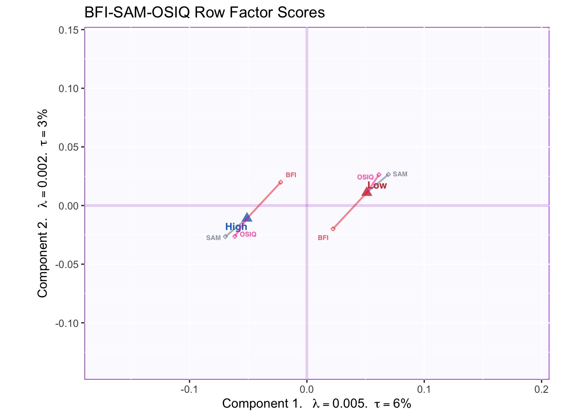

# Multiple Factor Analysis


Multiple Factor Analysis is a multi-table adaptation of PCA. Similar to PCA, MFA summarizes a matrix by performing its singular value decomposition. However, to prevent a single table from dominating the overall decomposition—which happens when one of the tables has a higher inertia than the others—MFA equalizes the contributions from the multiple tables. This equalization amount to performing a "preliminary" PCA separately on each table and then dividing them by their own first singular value. Dividing by the first singular value (i.e. the square root of the eigen-value; a quantity akin to standard deviation) amounts to scaling each table so that it can be compared against the others—analagous to a Z-score standardization but for tables instead of individual variables. An equivalent procedure is to carry out a generalized singular value decomposition  of the grand matrix by weighting each column by a quantity known as alpha—the inverse of the first squared singular value for a given table— all columns of a given table share the same weight.  
\indent In this example, I use MFA to analyze three tables that describe the same observations but different variables. Nevertheless, MFA can be used to analyze different measurements at different timepoints as long as the observations remain the same; dual-MFA is a variation where the same variables can be analyzed on different populations. 

## Data
The three tables used in this analysis are the BFI, SAM and OSIQ. The OSIQ, short for Object-Spatial Imagery Questionnaire, is a self-report questionnaire that captures individual preferences in visualizing. Object imagery is the tendency to visualize through colors, shapes, size and other specific visual qualities of objects; Spatial imagery is the tendency to "visualize" abstract representations of relationship and relative positions between objects and concepts. 


```
##    ID s01 s02 s03 o04 s05 s06 o07
## 1 164   4   3   3   4   2   1   4
## 2 220   2   4   2   4   2   4   4
## 3 222   5   5   1   2   5   1   1
## 4 444   4   4   2   2   5   5   5
```

Object imagery items are marked with an "o", while spatial imagery items are marked with "s".

## Correlation Matrix
After the scaling procedure described above—where each table is divided by its first singular value—MFA amounts to a PCA of the concatenated tables. [Recall that this, in turn, amounts to the SVD of the data table, or the eigen decomposition of the correlation/covariance matrix.]  
\indent Below, the correlation matrix between tables is displayed, with lines separating the tables for ease of interpretation. 


In the third column, the correlation matrix reveals that spatial and object imagery have dissociable correlation patterns: correlations with object imagery are strongest with Extraversion, Openness and Episodic Memory and Future Prospection. In particular, the strongest inter-table correlations are between the OSIQ and the SAM, therefore we can predict that variables in these table will largely contribute to the first component. 

##Running MFA
MFA is executed with the 'mpMFA' function from the MExPosition package. The function takes the concatenated raw data tables as one matrix or data frame, and it also requires a vector that indexes which columns belong to which table.


## Scree Plot
The scree plot below reveals one component that captures a lot of variance (20%) relative to the other components. In total, there may be somewhere between 6 and 7 significant components, as indicated by the elbow test. This document only displays graphical representations for Dimensions 1 and 2 (refer to the source file for graphs of remaining dimensions and their rotated equivalents).


## Factor Scores
Just like in PCA, factor scores in MFA represent the projection of observations (data point) onto a component (axis). Unlike PCA, however, MFA produces two sets of factor scores: compromise factor scores and partial factor scores. Compromise factor scores are derived from a weighted averaging of partial factor scores that takes into account the alpha of each table. The partial factor scores, on the other hand, correspond to a projection of each table onto its corresponding table of loadings (Q). 


The tolerance intervals in the above graph show that groups moderately overlap. The mean of each group displayed here corresponds to the average compromise factor scores for that group. 


This graph shows that means of high and low episodic memory groups significantly differ on component 1 and to a lesser extent on component 2. This is signaled by the non-overlapping of bootstrapped confidence intervals (ellipses).

To understand what drives these group differences, we may interpret the diagonal line separating group means as resulting from variation along a set of (linear combinations of) variables. Graphing factor loadings will reveal which variables correlate highly with this diagonal.

## Factor loadings
As in PCA, factor loadings in MFA can be calculated by multiplying the matrix Q (the angles between variables and components) by the diagonal matrix of singular values (i.e. scaling factors corresponding to the variance on each dimension). Graphing the resulting matrix provides us with a visual representation of: (1) the correlation between variables, interpreted as the angle between variable vectors (which always cross the origin); (2) the correlation between variables and components, interpreted as the angle between a variable vector and an axis; and (3) the contribution of a variable to a component, interpreted as the projection of the variable vector onto an axis; (4) the relative inertia explained by each component and its associated variables, interpreted as the length of each axis and the distance between variable vectors and the origin.  


In this graph, we can appreciate that the first component is dominated by SAM and OSIQ variables, while the second component reflects BFI items. However, a richer interpretation can be arrived at by considering the two components together. We can see that the end of a lot of variable vectors (i.e. the points) agglomerate somewhere around (x = -0.02, y = -0.005). Thus the diagonal crossing this point (approximately) and the origin, is an important feature of this component-solution.  
\indent Incidentally, this diagonal corresponds with the diagonal between group means, to an extent. Thus, we may interpret differences between group means in part due to Episodic Memory, Future Prospection and Object Imagery. However, other variables are likely at play since the diagonal line projected onto the group means has a slightly different angle; projected outward that diagonal would cross the point at x = -0.02, y = -0.0025. This suggests a contribution from some of the BFI items such as Openness and perhaps Extraversion. We may confirm this interpretation by graphing variable contributions. 

## Partial Factor Scores
A unique feature of MFA (and other multi-table techniques) is the inclusion of partial factor scores. When MFA is used to analyze multiple tables, partial scores can be used to display how each of the tables differ from "the average view" in how they describe observations or groups. This is achieved by projecting each table separately onto the eigen-vector space. The graphical result corresponds to a "weighting" such that the distance from the (multi-table) barycenter varies per table.  
\indent The graph below shows the partial factor scores for the BFI, SAM and OSIQ.



Tables differ in how they represent the groups. SAM and OSIQ are mostly in agreement and better differentiate between groups by pulling the means apart. BFI, however, displays a central tendency, which contrasts with the other tables. This suggests that excluding the BFI would lead to higher group discrimination: for example, a BADA (or MUBADA) with either (or both) of these two tables would lead to higher classification accuracy than the BFI. Thus, MFA results here suggest further implementations and analyses.

## Contributions 

The barplots below show contributions for Components 1 and 2 separately. 


As predicted, major contributions for Component 1 include Episodic Memory, Future Prospection and Object Imagery items, together with a relatively smaller contribution from Openness items. 

## Summary 
MFA allows for the examination of multiple data tables at the same time by revealing the overall correlation patterns between their variables. If factorial designs are part of the experiment, MFA may be used to analyze group differences by bootstrapping confidence intervals.  
\indent The present analyses showed that one dimension—composed of memory, imagery and openness items—accounts for a relatively high proportion of variance in the current experimental design. Openness is moderately correlated to Episodic Memory and Future Prospection relative to Object Imagery, whose correlation with memory items is the strongest in the whole correlation matrix. 


