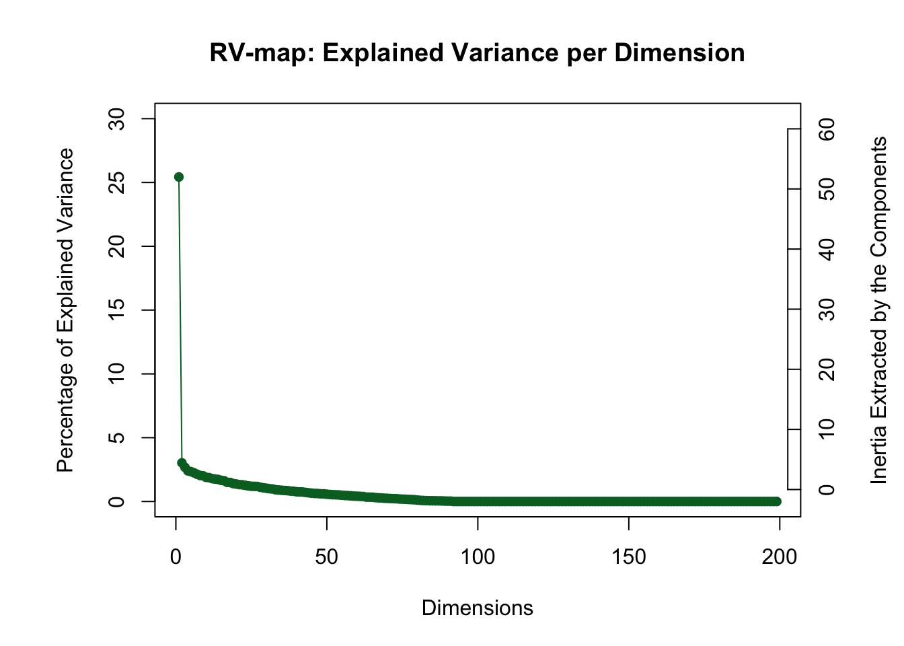
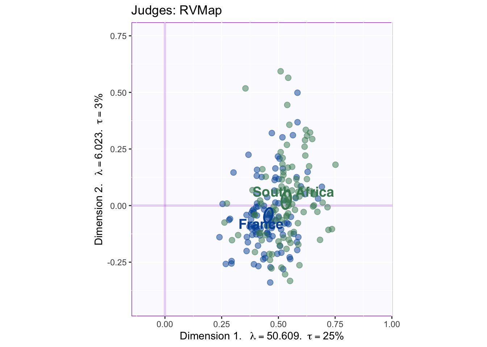
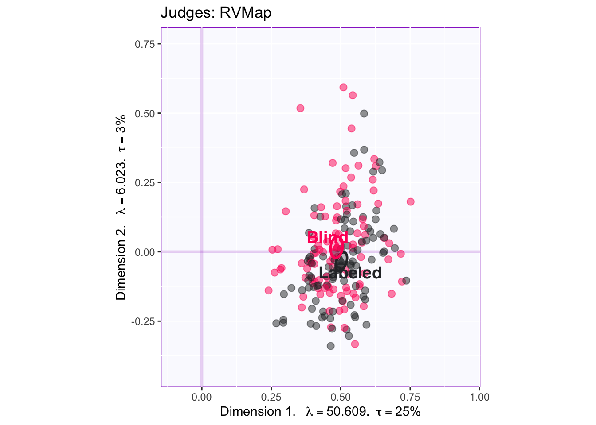
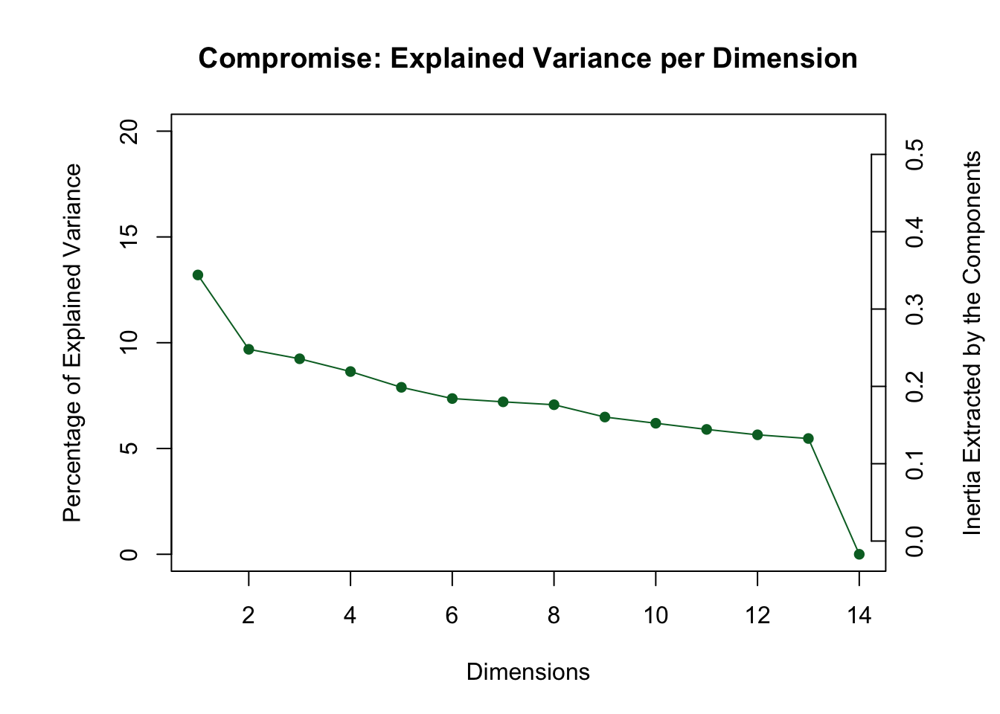
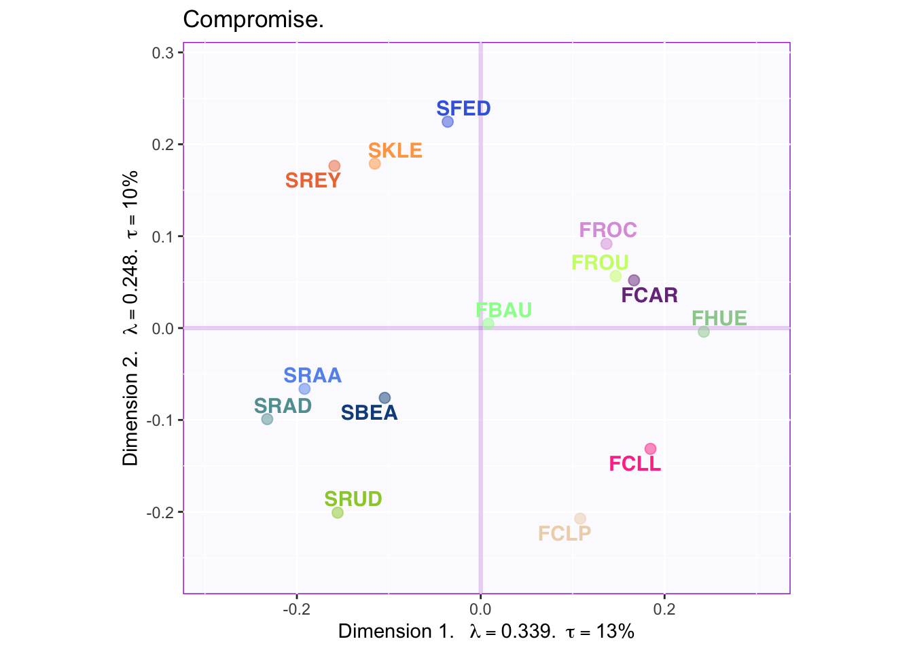
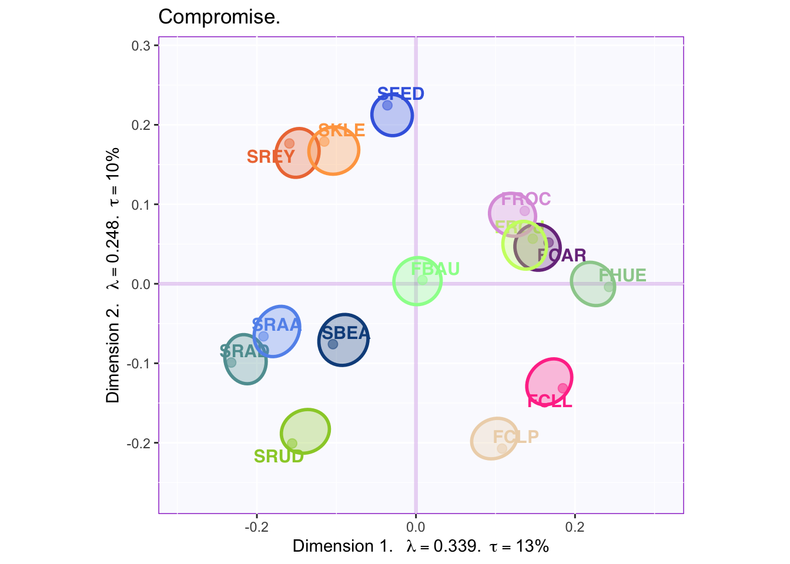
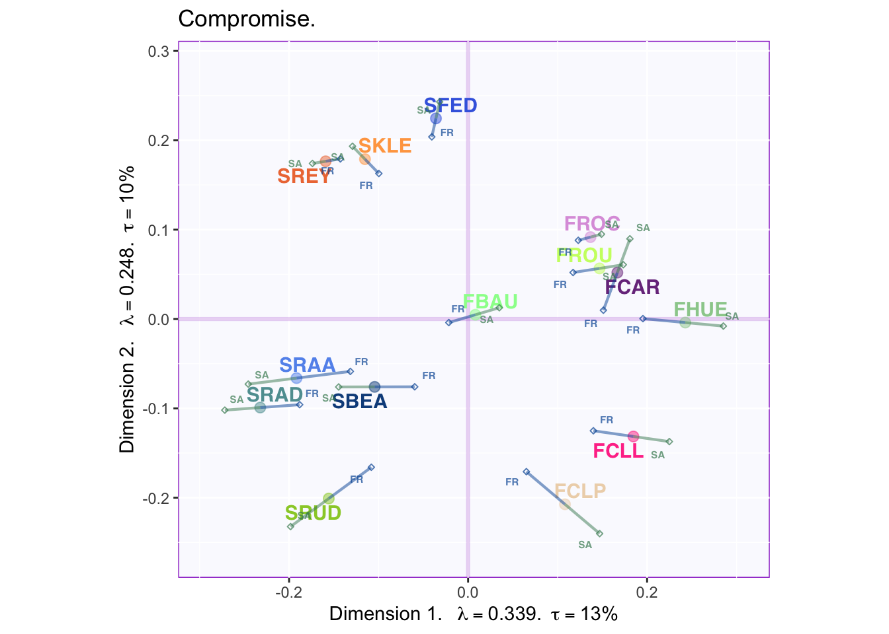
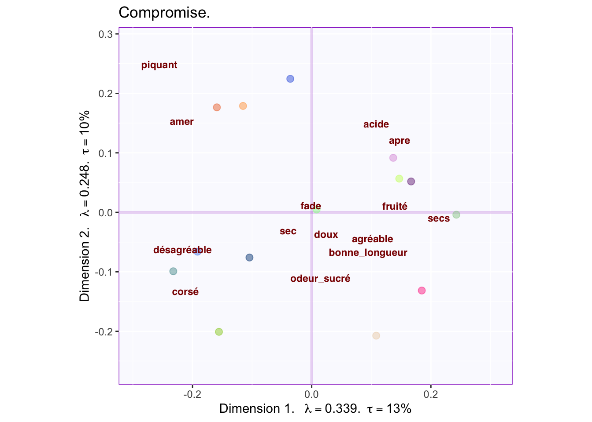
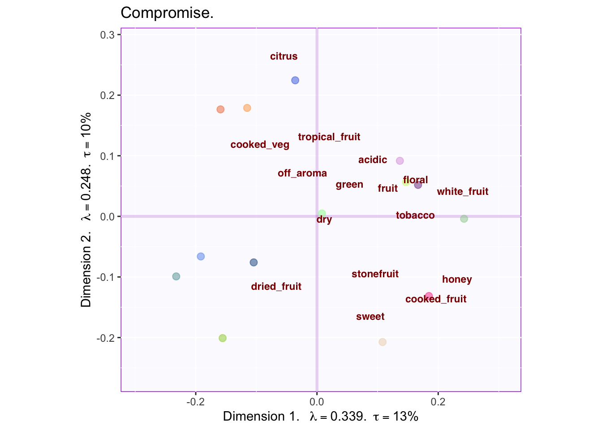

# DiSTATIS


DiSTATIS is a statistical technique belonging to the family of SVD-based methods (i.e. the PCA-related analyses covered in this cookbook). It was developed to analyze sorting experiments where participants are asked to group stimuli according to any criteria. [However, the main idea has been adapted in multiple way, one of which—CovSTATIS— has the purpose of summarizing functional connectivity data (see Herve Abdi on Darthmouth Youtube page.] DiSTATIS may reveal the (implicit) criteria underlying participants choice for grouping stimuli. It does this by leveraging participant-generated descriptions and experimental factors to interpret results. 

#### Distance matrices 
The data that DiSTATIS analyzes is a collection (i.e. a cube) of distance matrices. After a participant sorts stimuli into groups, a distance matrix is computed to describe the relationships between stimuli. In this stimuli-by-stimuli matrix, a 0 at the intersection of a row and colum denotes that these stimuli have been sorted into the same group (or, in the case of the diagonal, that they are the same stimuli). A 1 denotes that stimuli do **not** belong to the same group; a 0, that they do.

#### The Compromise
An SVD performed on single distance matrices is called Multidimensional Scaling. However, in DiSTATIS, the data to be described is a stimuli-by-stimuli-by-participant distance cube (i.e. distance matrices for all participants combined). The aim is to find the optimal compromise between distance matrices, or to find a linear combination such that matrices that are more "average" are weighted more. This implies the examination of between-respondent patterns, meaning a correlation between matrices.

#### The Rv matrix
The Rv coefficient quantifies the similarity between two matrices. It is equivalent to a squared correlation between two vectorized matrices. The Rv matrix in DiSTATIS contains Rv coefficients describing the similarity between respondent's distance matrix. The eigen-decomposition of the Rv matrix (i.e. C) will provide the weights for computing the ideal compromise. 

#### S+ 
The compromise matrix (i.e. the average of all distance matrices) is denoted S+. This resulting matrix is eigen-decomposed (i.e. the second eigendecomposition!) to provide a space that describes the stimuli. Also, each assessor's data can be projected onto this subspace. Thus, systematic variations from the compromise can be grasped by analyzing the projections according to assessor's characteristics: certain characteristics, such as gender, might contribute to a certain pattern of deviations, in men vs. women for example.

## The Data
The Data used in this example corresponds to an experiment in which raters from either France or South Africa were asked to sort a set of 14 wines: 7 from France and 7 from South Africa. Rater's country of origin provides the first (quasi-) experimental factor in the design. The second (actual) experimental factor corresponds to whether raters were shown labels for the wines or not. In the table below, rows represent wines while columns represent each judge; numbers in each cell represent the (arbitrary) groups used by each jugde to describe the wines.


```
##      J1 J2 J3 J4 J5 J6 J7 J8 J9
## FCAR  2  2  2  2  2  3  4  3  4
## SRUD  1  1  6  5  2  3  4  4  3
## FBAU  1  1  5  3  4  2  2  2  2
## FROC  1  1  3  2  2  2  3  3  2
## SFED  1  2  4  4  2  2  3  3  2
## SREY  3  1  5  2  3  2  3  1  6
## SKLE  1  1  5  5  2  3  1  2  6
## FCLL  2  2  2  4  2  3  4  3  4
## FCLP  2  1  3  5  1  1  4  4  1
## SRAD  3  1  2  1  1  1  1  1  1
```

## Running DiSTATIS
DiSTATIS is executed by the 'distatis' function in the DistatisR package (installed from from Dr. HerveAbdi github: 'HerveAbdi'). The "distance cube" is calculated from the sort data with the function 'DistanceFromSort' from the same package.

```r
# Run Distatis ------------------------------------------------------------
distanceCube = DistanceFromSort(sort.data) 
resDistatis = distatis(distanceCube)
```

## ScreePlot Rv Matrix

The scree plot of the Rv matrix shows that respondents vary across one dimension. 


## The Rv-map

The Rv-map provides a graphical description of raters. By coloring according to experimental or subject variables overall patterns driving differences can be revealed at this stage.



The graph shows French raters as blue and South African raters as green. Ellipses representing confidence intervals for group means show that groups differ in how they rated the wines. Component 1 of the Rv matrix always represents communality. Thus, the South African raters were more common with the total of participants while the French raters tended to be more unique. This suggests an interesting trend that will be relevant when graphing compromise factor scores.  

The same Rv-map color-coded by condition is graphed below to reveal the presence (or absence) of experimental effects.



The overlap ellipses show that whether a subject was shown a labeled or an unlabeled wine did not significantly affect how they rated that wine.

## Compromise factor scores
Each assessor's factor score on the first of the Rv-map eigenvalues is used to compute their weight in the calculation of the compromise. Thus, each assessor's distance matrix contributes to the compromise depending on this weight. What results is the S+ matrix (i.e. compromise matrix) which is then eigen-decomposed to provide the average perceptual map of the stimuli (i.e wines).

#### Scree plot for the compromise

The Rv scree plot shown above displays the results from the eigen-decomposition of the Rv-matrix, which describes *between-respondent* relationships on how they arate stimuli. The screeplot for the compromise (shown below), describes the eigen decomposition of the average *between-stimuli* distances. 



The first two dimensions explaining 24% of the variance are displayed in what follows. 

#### Factor Map


```
## [1] Bootstrap On Factor Scores. Iterations #: 
## [2] 1000
```


The factor map shows a clear effect where South African wines (starting with S) are clearly separated from French wines on Dimension 1. 

Below, the added confidence intervals suggest small areas of overlap between some wines of the same country (but not between wines of different countries). Dimension 2 appears to distinguish between two classes of South African wine; also, a couple of french wines are similar to South African wines that load negatively onto component two.


#### Partial Factor Maps
The Rv-map showed a statistically significant difference between French and South African raters. To explore how country of origin (or any experimental or quasi-experimental factor) contributes to the compromise, partial factor maps may be graphed. 



The lines stretching out from the (stimuli) factor scores, are the *partial* factor scores representing the average rating for participants of each country. For example, 'FR' represents how the average French participant rated each wine. By interpreting the overall trend or trends specific to each item, more information can be gathered on what distinguished French from South African wine raters.  
 In this case, there is a strong effect such that French raters tend to be closer toward the barycenter than South African raters. Thus, the French participants view each wine as more 'average' while South African participants see more uniqueness in the wines. 
 
## Projecting descriptors

A key way to leverage sorting data is to ask participants to describe stimuli they have grouped together. Recording how many times each descriptors applies to each wine, provides data that can be later projected onto the eigenvector space of a DiSTATIS analysis. The distance between each descriptor and each wine becomes interpretable in the same way that the distance between rows and columns are interpretable in Correspondence Analysis.


```
## Warning: Removed 1 rows containing missing values (geom_text_repel).
```



The graph shows the descriptions from the french raters projected onto the compromise. The terms 'agréable' and 'desagréable' sitting at opposite ends define component 1: French raters tended to like french wines better than South African wines. They considered that good wines are fruity and dry. They also considered the South African wines as either bitter or rough. Further, for french people, component two seems to capture the sweetness of the wine.

Below are the english descriptors projected onto the same space.


```
## Warning: Removed 1 rows containing missing values (geom_text_repel).
```



The graph shows some overlap between descriptors used by French and South African raters. First, descriptions of acidic and fruity fall on the same region. Second, sweetness loads strongly on component 2, being opposite to acidic. Interestengly, South African raters perceive South African wines as either citric (or tasting like cooked vegetables?) or tasting like dried fruit. The descriptor of 'dried fruit' is opposite to descriptors of 'fruit', 'tropical fruit' and 'white fruit', revealing that they are negatively correlated.

## Summary
DiSTATIS is used to analyze sorting data. The procedure in DiSTATIS involves computing distances based on the sorting of data and executing two separate eigendecompositions (one on the correlation between raters, one on the average perceptual map—i.e. compromise). In this example, DiSTATIS was used to reveal that South African wines are perceived as different than French wines (or worse-tasting, as the French raters would have it). Also, French raters tended to give more average ratings for the wines than did South African raters. In relation to South African wines, there appeared to be two classes: sweet wines vs citric wines; French wines however, were perceived as more fruity and a few of these wines were sweet.


